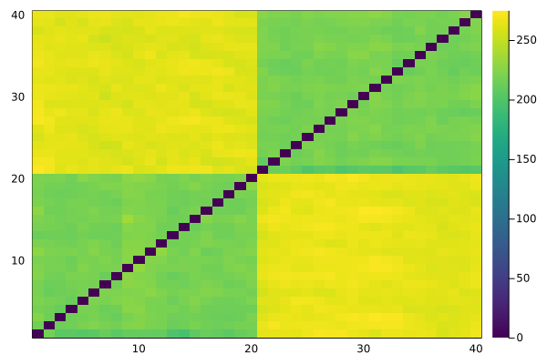

# Core-to-Core Latency

Let's measure the inter-core latencies of one of the compute nodes of [Noctua 1](https://pc2.uni-paderborn.de/hpc-services/available-systems/noctua1) at [PC2](https://pc2.uni-paderborn.de).
```julia
using ThreadPinning
latencies = ThreadPinning.bench_core2core_latency()
```
```
40×40 Matrix{Float64}:
   0.0   217.05  204.85  206.0   203.3   204.95  211.7   205.2   209.5   210.1   209.65  209.3   198.7   194.95  …  271.1   267.5   265.0   260.85  266.9   267.15  265.8   266.7   265.55  258.85  262.1   263.95  269.4
 215.55    0.0   214.65  215.15  219.8   222.1   219.55  217.1   223.1   224.7   220.25  219.45  213.2   214.6      266.6   269.45  269.85  270.6   271.25  271.1   267.45  265.65  263.15  259.85  260.85  263.2   267.45
 224.2   214.75    0.0   216.05  217.35  219.25  216.45  212.95  219.15  224.4   221.45  219.65  214.55  215.75     270.35  272.55  270.95  275.0   272.15  272.95  267.5   264.15  260.35  263.2   260.8   262.2   264.65
 218.4   216.7   211.9     0.0   220.05  218.5   213.2   215.35  225.85  226.7   220.15  218.7   218.6   216.1      266.85  265.75  266.0   265.8   264.7   265.25  259.7   260.9   260.25  258.6   259.6   262.75  262.0
 221.95  218.5   217.25  212.7     0.0   221.6   220.15  223.75  226.15  224.0   219.45  220.2   214.35  219.3      264.55  267.0   262.6   262.35  264.2   262.2   262.2   263.25  262.4   262.35  264.3   263.7   262.55
 219.85  212.5   214.6   216.25  218.75    0.0   221.5   221.45  222.6   223.8   227.35  222.8   217.95  221.55  …  265.75  267.95  263.8   264.5   265.4   262.95  265.7   264.55  261.9   263.7   265.25  259.95  261.35
 219.15  214.0   214.65  217.8   218.85  217.9     0.0   217.15  227.75  225.6   224.05  217.4   216.8   215.15     266.85  269.95  267.85  264.1   262.55  266.15  267.6   267.1   266.25  263.75  260.95  264.4   267.9
   ⋮                                       ⋮                                       ⋮                             ⋱                            ⋮                                       ⋮
 269.75  265.85  263.4   265.65  265.0   266.8   265.8   264.15  261.35  258.3   262.65  264.45  265.5   268.05     216.55  221.35  219.5   221.05  220.1   211.45    0.0   219.05  219.45  214.95  213.8   212.75  214.9
 267.95  265.7   262.2   262.75  262.0   266.35  264.1   260.45  257.4   264.05  268.05  259.85  264.6   265.4      218.6   225.85  226.8   219.3   220.75  215.7   215.95    0.0   221.05  218.35  214.5   214.2   217.3
 265.65  262.7   263.2   261.8   261.7   260.8   260.95  257.55  259.15  262.05  264.95  263.1   259.55  259.75  …  221.15  223.75  222.8   226.45  226.25  221.05  221.8   219.6     0.0   215.2   216.55  220.45  222.2
 264.4   263.0   265.85  263.6   265.35  257.25  254.2   258.5   261.6   259.95  259.45  262.3   262.65  259.25     219.0   217.95  218.6   223.2   220.75  215.1   215.2   218.25  216.35    0.0   215.75  216.8   220.15
 258.75  262.2   264.2   262.55  262.4   262.6   259.05  258.65  257.5   259.4   265.45  260.1   260.2   261.6      217.4   220.85  219.15  218.05  214.5   214.15  215.8   224.5   217.2   217.35    0.0   218.75  222.8
 264.5   263.35  257.0   262.9   258.65  264.95  266.05  260.75  259.15  264.8   263.95  265.5   267.3   265.35     221.95  222.65  224.25  221.05  220.95  216.5   220.25  220.5   217.2   218.5   218.05    0.0   223.1
 266.6   266.35  262.65  262.2   264.45  267.2   266.8   264.25  263.75  262.75  264.5   266.55  267.4   271.6      223.9   226.0   225.6   228.65  225.3   219.85  218.25  220.55  220.75  217.1   220.2   225.15    0.0
```

Of course, it is easier to make sense of the result if we visualize it.
Here, we use [Plots.jl](https://github.com/JuliaPlots/Plots.jl)'s `heatmap` function.
```julia
using Plots
heatmap(latencies; c = :viridis, frame=:box)
```


The two sockets / CPUs of the system with 20 cores each are clearly visible since the inter-core latency of cores on different sockets is, expectedly, higher than the same for cores sitting on the same socket / in the same CPU. Note that due to fluctuations in our imperfect benchmark the result is not precisely symmetric (which, of course, it should be in theory).