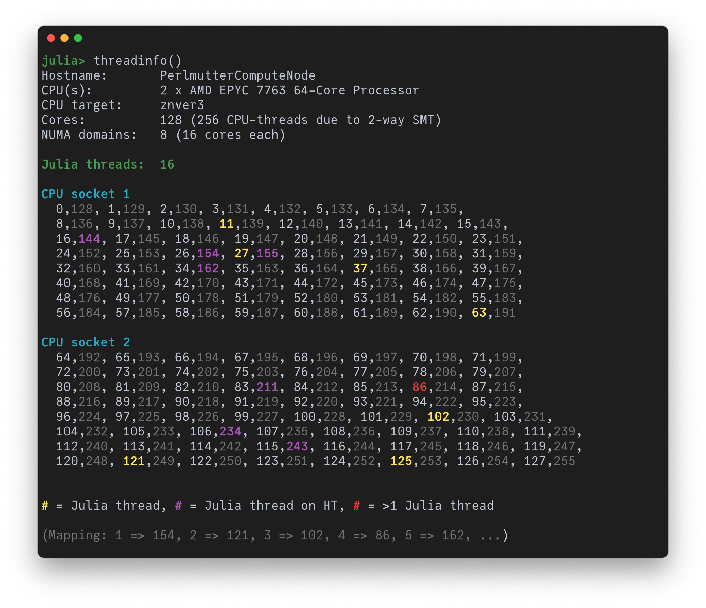

# Pinning Julia Threads

The most important functions are [`pinthreads`](@ref) and [`threadinfo`](@ref). The former allows you to pin threads. The latter visualizes the current thread-processor mapping and the system topology. Please check out the comprehensive documentation of these functions for detailed information. 

## Typical usage

### `pinthreads`
Pinning your threads is as simple as putting the following at the top of your Julia code:
```julia
using ThreadPinning
pinthreads(:cores)
```
This will successively pin all Julia threads to CPU-cores in logical order, avoiding "hyperthreads" if possible. Of course, you can replace `:cores` by all the options supported by [`pinthreads`](@ref). Conceptually, there are three different formats to specify your desired thread-processor mapping:

1) predefined symbols (e.g. `:cores` or `:sockets`),
2) logical specification of domains via [helper functions](@ref api_logical) (e.g. [`node`](@ref) and [`socket`](@ref)),
3) explicit lists of CPU IDs, e.g. `0:3` or `[0,12,4]` (as the OS defines them).

For example, instead of `pinthreads(:cores)` above, you could write `pinthreads(:sockets)`, `pinthreads(socket(1,1:3), numa(2,2:5))`, or `pinthreads(1:2:10)`. See [`pinthreads`](@ref) for more information.

### `threadinfo`
To check and visualize the current placement of threads you can use [`threadinfo`](@ref).



As you can see, this image is taken on a dual-socket system where each CPU has 64 CPU-cores and Julia has been started with 5 threads. Hyperthreading is enabled with two CPU-threads per core (the greyed out numbers indicate hyperthreads/SMT-threads and the gap between numbers indicates different cores).

Notably, the threads aren't pinned. Not only are they randomly placed on the system but two of them do even overlap in the sense that they are currently both running on the same CPU-thread, leading to contention.

If we pin threads to different cores (`pinthreads(:cores)`) and call `threadinfo()` again we obtain this:


#### Keyword options

Note that [`threadinfo`](@ref) has quite a number of keyword arguments that let you change or tune the output. The most important one is probably `groupby`. It allows you to switch from socket to, say, NUMA/memory domain visualization (`groupby=:numa`).

```julia
julia> pinthreads(:numa) # round-robin distribution among NUMA domains

julia> threadinfo(; color=false, groupby=:numa) # grouping by NUMA domains (instead of CPU sockets)
Hostname: 	PerlmutterComputeNode
CPU(s): 	2 x AMD EPYC 7763 64-Core Processor
CPU target: 	znver3
Cores: 		128 (256 CPU-threads due to 2-way SMT)
NUMA domains: 	8 (16 cores each)

Julia threads: 	16

NUMA domain 1
  0,_, 1,_, _,_, _,_, _,_, _,_, _,_, _,_,
  _,_, _,_, _,_, _,_, _,_, _,_, _,_, _,_

NUMA domain 2
  16,_, 17,_, _,_, _,_, _,_, _,_, _,_, _,_,
  _,_, _,_, _,_, _,_, _,_, _,_, _,_, _,_

NUMA domain 3
  32,_, 33,_, _,_, _,_, _,_, _,_, _,_, _,_,
  _,_, _,_, _,_, _,_, _,_, _,_, _,_, _,_

NUMA domain 4
  48,_, 49,_, _,_, _,_, _,_, _,_, _,_, _,_,
  _,_, _,_, _,_, _,_, _,_, _,_, _,_, _,_

NUMA domain 5
  64,_, 65,_, _,_, _,_, _,_, _,_, _,_, _,_,
  _,_, _,_, _,_, _,_, _,_, _,_, _,_, _,_

NUMA domain 6
  80,_, 81,_, _,_, _,_, _,_, _,_, _,_, _,_,
  _,_, _,_, _,_, _,_, _,_, _,_, _,_, _,_

NUMA domain 7
  96,_, 97,_, _,_, _,_, _,_, _,_, _,_, _,_,
  _,_, _,_, _,_, _,_, _,_, _,_, _,_, _,_

NUMA domain 8
  112,_, 113,_, _,_, _,_, _,_, _,_, _,_, _,_,
  _,_, _,_, _,_, _,_, _,_, _,_, _,_, _,_


# = Julia thread, # = Julia thread on HT, # = >1 Julia thread

(Mapping: 1 => 0, 2 => 16, 3 => 32, 4 => 48, 5 => 64, ...)

```

There is much more, though. Rather than Julia threads you can highlight BLAS threads (after you've pinned them) with `blas=true`. If you're in a SLURM allocation, you might want to give `slurm=true` a try. For more, please check out the [`threadinfo()`](@ref) documentation.

## Unpinning

We provide functions [`unpinthread(threadid)`](@ref) and [`unpinthreads()`](@ref) to unpin a specific or all Julia threads, respectively. This is realized by setting the thread affinity mask to all ones.

As an alternative, you might also want to consider using `pinthreads(:random)` for "fake unpinning". While technically not really unpinning the threads, it's often a better choice (e.g. for benchmarks) as it does randomize the thread placing but keeps it fixed to reduce fluctuations.

## Default pinning (for package authors)

If you're developing a package you may want to provide a reasonable default pinning. If you would naively use `pinthreads` for this, you would enforce a certain pinning irrespective of what the user might have specified manually. This is because `pinthreads` has the highest precedence. To lower the latter you can set `force=false` in your `pinthreads` call, e.g. `pinthreads(:cores; force=false)`. This way, a user can overwrite your default pinning (`:cores` in this example), e.g. by calling `pinthreads` manually before running your package code.
