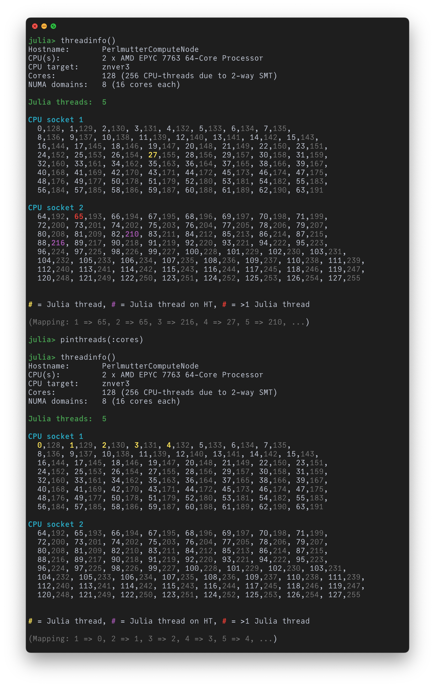

# Pinning Julia Threads

The most important functions are [`pinthreads`](@ref) and [`threadinfo`](@ref). The former allows you to pin threads. The latter visualizes the current thread-processor mapping and the system topology. Please check out the comprehensive documentation of these functions for detailed information. 

## Typical usage

### `pinthreads`
Pinning your threads is as simple as putting the following at the top of your Julia code:
```julia
using ThreadPinning
pinthreads(:cores)
```
This will successively pin all Julia threads to CPU-cores in logical order, avoiding "hyperthreads" if possible. Of course, you can replace `:cores` by all the options supported by [`pinthreads`](@ref). Conceptually, there are three different formats to specify your desired thread-processor mapping:

1) predefined symbols (e.g. `:cores` or `:sockets`),
2) logical specification of domains via [helper functions](@ref api_logical) (e.g. [`node`](@ref) and [`socket`](@ref)),
3) explicit lists of CPU IDs, e.g. `0:3` or `[0,12,4]` (as the OS defines them).

For example, instead of `pinthreads(:cores)` above, you could write `pinthreads(:sockets)`, `pinthreads(socket(1,1:3), numa(2,2:5))`, or `pinthreads(1:2:10)`. See [`pinthreads`](@ref) for more information.

### `threadinfo`
To check and visualize the current pinning you can use [`threadinfo`](@ref) to get something like this.



As you can see, this image is taken on a dual-socket system (indicated by the two `| .... |` sections) where each CPU has 20 CPU-cores and Julia has been started with 40 threads. Hyperthreading is enabled - the greyed out numbers indicate hyperthreads/SMT-threads - with two CPU-threads per core.

Note that [`threadinfo`](@ref) has a few keyword arguments that let you change or tune the output. The most important ones are probably `groupby` and `color`. The former allows you to switch from socket to, say, NUMA/memory domain visualization (`groupby=:numa`). The latter allows you to switch to non-colored output (see below).

```julia
julia> using ThreadPinning

julia> threadinfo(; color=false)

| 0,1,_,3,4,_,_,7,8,_,10,_,_,_,_,_,
  16,17,_,_,40,_,42,_,_,_,_,47,48,49,50,51,
  _,_,54,_,_,57,58,_ |
| _,21,22,23,_,_,_,_,28,29,30,_,32,33,_,35,
  _,_,38,39,60,61,62,63,64,65,_,_,68,_,_,_,
  72,73,74,_,_,_,_,_ |

# = Julia thread, # = HT, # = Julia thread on HT, | = Socket seperator

Julia threads: 40
├ Occupied CPU-threads: 40
└ Mapping (Thread => CPUID): 1 => 63, 2 => 64, 3 => 17, 4 => 68, 5 => 4, ...


julia> pinthreads(:cores)

julia> threadinfo(; color=false)

| 0,1,2,3,4,5,6,7,8,9,10,11,12,13,14,15,
  16,17,18,19,_,_,_,_,_,_,_,_,_,_,_,_,
  _,_,_,_,_,_,_,_ |
| 20,21,22,23,24,25,26,27,28,29,30,31,32,33,34,35,
  36,37,38,39,_,_,_,_,_,_,_,_,_,_,_,_,
  _,_,_,_,_,_,_,_ |

# = Julia thread, # = HT, # = Julia thread on HT, | = Socket seperator

Julia threads: 40
├ Occupied CPU-threads: 40
└ Mapping (Thread => CPUID): 1 => 0, 2 => 1, 3 => 2, 4 => 3, 5 => 4, ...
```

## Unpinning

We provide functions [`unpinthread(threadid)`](@ref) and [`unpinthreads()`](@ref) to unpin a specific or all Julia threads, respectively. This is realized by setting the thread affinity mask to all ones. While technically not really unpinning threads, you might also want to consider using `pinthreads(:random)` for "fake unpinning" in benchmarks as it does randomize the thread placing but keeps it fixed to reduce measurement fluctuations.

## Default pinning (for package authors)

If you're developing a package you may want to provide a reasonable default pinning. If you would naively use `pinthreads` for this, you would enforce a certain pinning irrespective of what the user might have specified manually. This is because `pinthreads` has the highest precedence. To lower the latter you can set `force=false` in your `pinthreads` call, e.g. `pinthreads(:cores; force=false)`. This way, a user can overwrite your default pinning (`:cores` in this example), e.g. by calling `pinthreads` manually before running your package code.

## `likwid-pin`-compatible input

Separate from [`pinthreads`](@ref), used and described above, we offer [`pinthreads_likwidpin`](@ref) which, ideally, should handle all inputs that are supported by the `-c` option of [`likwid-pin`](https://github.com/RRZE-HPC/likwid/wiki/Likwid-Pin) (e.g. `S0:1-3@S1:2,4,5` or `E:N:4:2:4`). If you encounter an input that doesn't work as expected, please file an issue.
